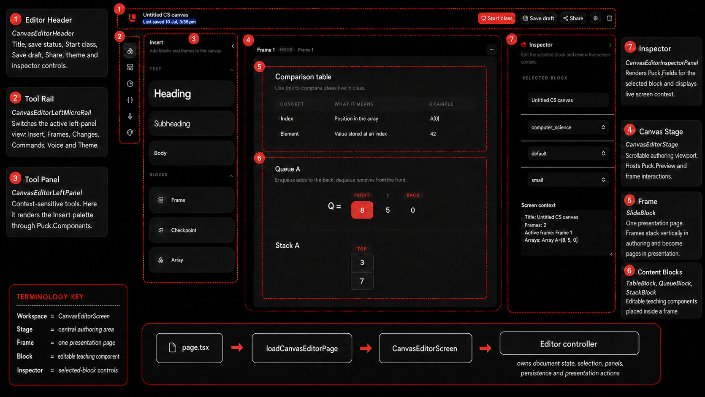

for MITsdafasd f

UI nomenclature

| Area | Name |
|---|---|
| Entire authoring UI | **Canvas Editor** |
| Narrow left icon bar | **Tool Rail** |
| Expandable left sidebar | **Tool Panel** |
| Central workspace | **Stage** |
| Individual lesson pages | **Frames** |
| Right editing sidebar | **Inspector** |
