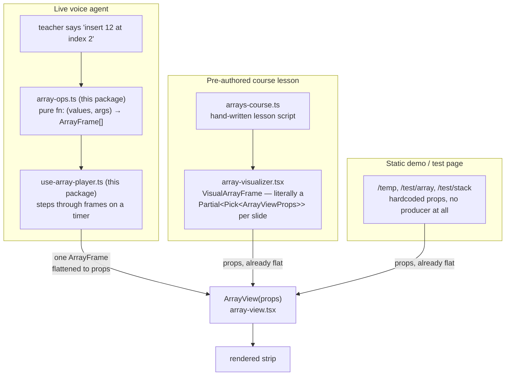
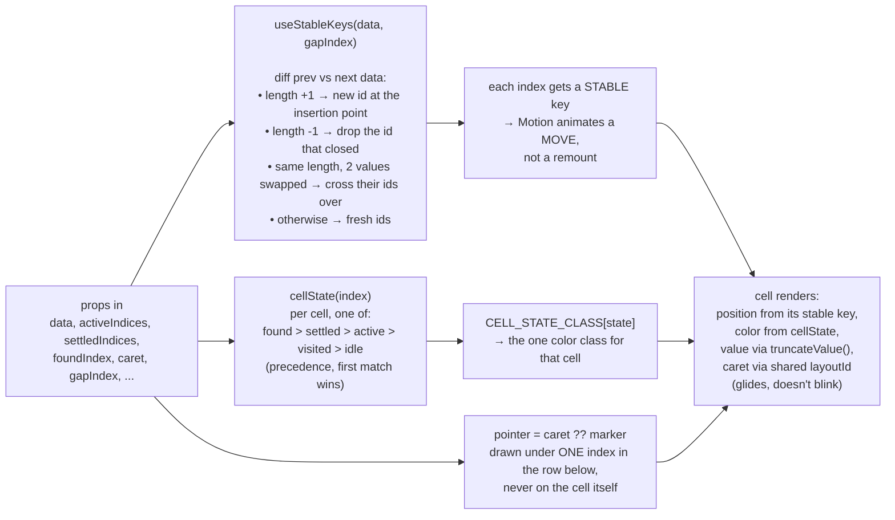

# Array module

The whole array concept, not just its rendering: the animation contract,
every structural/sorting/search/combine/analysis/code-generation operation,
the player hook, and the view. **Insert, delete, sort, search all live here**
— `array-ops.ts`, `array-sorting.ts`, `array-search.ts`, and friends, right
alongside `array-view.tsx`. See "Files" below for the full list.

This wasn't always true. Operations used to live in the app's
`arrays-agent/lib/` feature folder, on the theory that they were "what a
voice agent calls as tools" and therefore belonged near the agent. That
reasoning didn't hold up: every one of these files is a pure function with
zero React, zero OpenAI, zero canvas — importable by anything, agent or not
— and splitting "how arrays render" from "what arrays can do" across a
package and an app feature folder just meant looking in two places to
understand one concept. What's genuinely agent-specific (`ArrayAgentState`,
tool-schema wrapping, session memory) stayed in `arrays-agent/` — see that
feature's own docs for the boundary and why it's drawn there.

## Who feeds it, and what they feed it

Three real callers exist today. They don't share code with each other — they
only share the fact that they all end up calling `<ArrayView {...props} />`.



**The live agent is the only one that goes through `ArrayFrame`.** An
operation in `array-ops.ts` doesn't know about props or JSX — it returns a
*list* of `ArrayFrame` snapshots (one per animation beat), and something
upstream of this folder (`ArraysAgentBoard`, in the app) flattens whichever
frame is playing right now into the flat props below. The lesson and demo
paths skip `ArrayFrame` entirely and just hand `ArrayView` props directly —
there's nothing to animate through, so there's nothing to snapshot.

If you're adding a fourth producer: reuse `ArrayFrame` if you're building
something that plays out over TIME (a sequence of states). Skip it and pass
props directly if you're just describing ONE static picture.

## What `ArrayFrame` actually is

```mermaid
classDiagram
    class ArrayFrame {
        values: ArrayValue[]
        active: number[]
        visited: number[]
        settled: number[]
        found?: number
        marker?: { index, label }
        caret?: { index, label? }
        gap?: number
        held?: { value, label }
        note: string
    }
```

One snapshot, never a delta — `frame()` in `array-frame.ts` builds one. A
delta would force whatever plays these back to replay history just to know
the current state; a snapshot lets it jump anywhere. This is a **fixed
vocabulary**, not a grab-bag: `active` is the one cell being looked at,
`settled` means final/done, `found` means "this is the answer," `caret` means
"this position, not this value" (insert/delete point). Every operation in
`arrays-agent` reuses these same five ideas instead of inventing its own —
that's what lets one `ArrayView` render 20+ different operations without a
single `if (operationName === ...)` anywhere in this folder.

## What happens inside `ArrayView` for one render

This is the part worth actually reading in `array-view.tsx` — here's the
shape of it so the file isn't a wall of JSX the first time you open it.



The stable-key step is the one thing that isn't obvious from reading the
JSX top to bottom: without it, inserting a value at index 2 would make React
see "a shorter array became a longer one" and remount every cell from index 2
onward — which is what a value morphing into a different value looks like,
not what a slide looks like. `useStableKeys` is what turns "the array
changed" into "this specific element moved to this specific slot."

## Files

| File | What's in it |
|---|---|
| `array-frame.ts` | The `ArrayFrame`/`ArrayValue` types, `frame()` to build one, `MAX_ARRAY_LENGTH`, `truncateValue()`. Zero React. |
| `array-view.tsx` | The component. `useStableKeys`/`swappedIds`/`findDiffPoint` (identity across mutations), `cellState`/`CELL_STATE_CLASS` (five-state color vocabulary), `AccessExpressionLabel` (the floating `A[2]` label). |
| `array-types.ts` | Vocabulary every operation shares: `ArrayOpResult`, `AnimationSpeed`, `Complexity`, and the sort types (`SortOptions`, `SortResult`, `SortStep`, ...). NOT the agent's `ArrayAgentState` — that stays in `arrays-agent/lib/agent-state.ts`, since it's additionally true only because a voice session is driving a specific canvas block. |
| `array-helpers.ts` | Operation-level helpers: `toNumeric`/`toDisplayValues` coercion, `indexError` bounds-checking with teaching-language messages, the `COMPLEXITY` Big-O table spoken alongside every operation. |
| `array-ops.ts` | Structural operations: create, access, traverse, insert, delete (20+ functions, one category, no name overlap with the files below). |
| `array-sorting.ts` | The five sort algorithms, `runSort`/`compareAlgorithms`, `sortResultToFrames`. |
| `array-search.ts` | Linear search, binary search, find-all. |
| `array-combine.ts` | Concatenate, element-wise combine, merge-sorted. |
| `array-analysis.ts` | Frequency, duplicates, min/max, stats, `transformArray`. |
| `array-code.ts` | Rendering an array as a source-code declaration, and parsing one back (round-tripping a teacher's hand-edited code block). |
| `array-name.ts` | Deriving a valid identifier name for an array from a block's title (`arrayNameFromTitle`, `nextArrayName`). |
| `operation-code.ts` | The line of code that performs each operation, for the "here's what that looked like in code" teaching panel. |
| `use-array-player.ts` | Steps through an operation's `ArrayFrame[]` on a timer, same shape as every other concept's player hook in this package. |
| `index.ts` | The only import path anything outside this folder should use. The larger operation files are re-exported with `export *` rather than a hand-enumerated list — see the comment at the top of `index.ts` for why. |