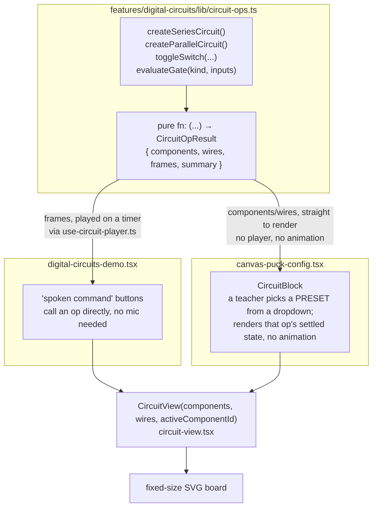
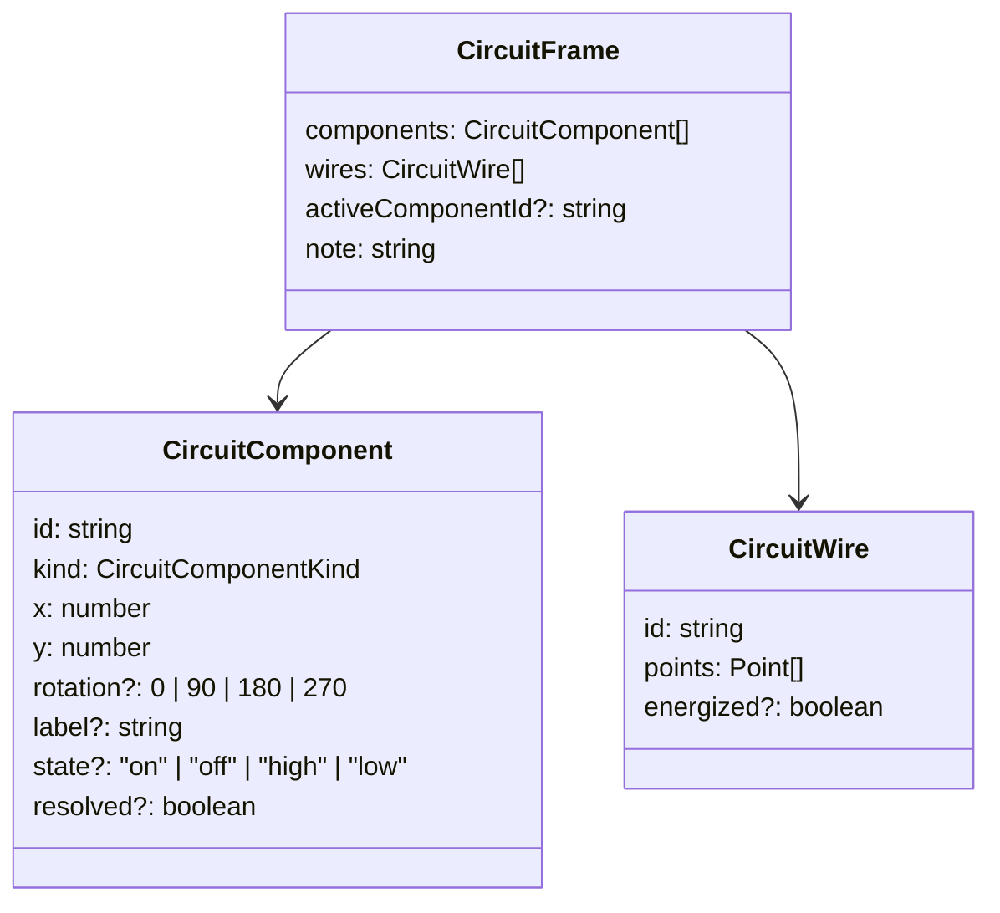
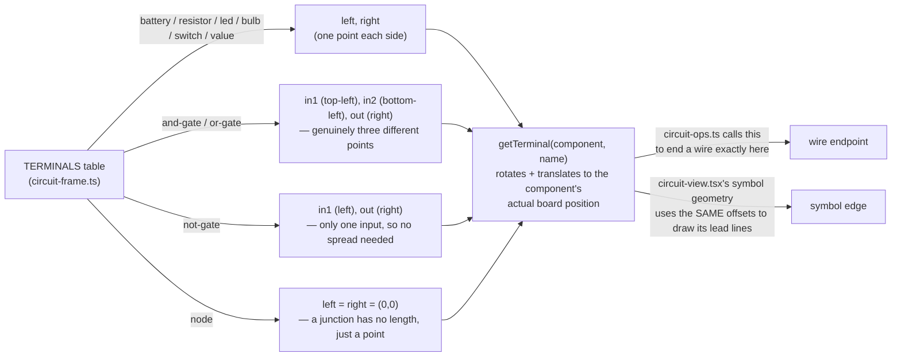
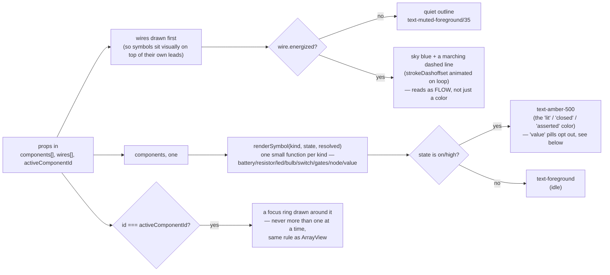

# Circuit module

Same shape as `@/components/data-structure/array`, one level over: a fixed
vocabulary (`CircuitFrame`), a dumb renderer (`CircuitView`) that only draws
what it's given, and a producer elsewhere that decides what that is. Read
`circuit-frame.ts` and `circuit-view.tsx` end to end and you've read all of
this folder — the actual circuit logic (series, parallel, logic gates) lives
one level up, in `features/digital-circuits/`, exactly how `arrays-agent`
sits above the array module.

## Why this isn't a pannable, zoomable canvas

Worth writing down, since it's the one decision that shapes everything else
here: this was built to explicitly NOT be a general graph-editor canvas
(React Flow, JointJS, etc.), even though one is already installed in this
app. The reasoning, in short — see the chat history for the full version:

- Nothing here is user-built. A teacher never drags a gate onto a canvas;
  the board always shows a picture something else decided.
- A teaching circuit has a handful of parts, never hundreds — there's no
  scale problem an infinite canvas or viewport virtualization solves.
- An infinite pannable canvas is a UI a viewer can get lost in. A fixed
  frame — the same one `<ArrayView>` uses — is one you can screenshot,
  present, and never need to explain "how do I get back to the middle."

So `CircuitView` renders one fixed-size `<svg viewBox="0 0 640 320">`. There
is no zoom, no pan, no minimap, and there's no plan to add them.

## Who feeds it

Two different consumers, same building block, used two different ways:

- **The demo** plays the FULL frame sequence — every beat of "close the
  switch, current reaches this wire, then this one, then the LED lights" —
  through `use-circuit-player.ts`, the circuit equivalent of
  `use-array-player.ts`.
- **The canvas block** only ever shows the LAST frame — a settled picture a
  teacher chose from a preset list, same as how `ArrayBlock` shows static
  authored values when no live agent is driving it. A Puck field can't
  reasonably let someone author 8 components and 9 wires by hand, so the
  block exposes the same small set of `circuit-ops.ts` functions as named
  presets instead.

There's no live voice agent behind either of these yet — see "what's not
here yet" below.

## What `CircuitFrame` actually is

`kind` is the fixed symbol set this module knows how to draw:
`battery`, `resistor`, `led`, `bulb`, `switch`, `and-gate`, `or-gate`,
`not-gate`, `node`, `value`. `state` is one loose field rather than nine
kind-specific ones, because every frame only ever needs to ask "is this
thing in its 'on' position right now" — a closed switch, a lit LED, and a
gate's asserted output are the same underlying question, drawn differently.
`resolved` only matters for `kind: "value"` — see the color table below.

**A wire is a polyline, not "a connection between two ids."** There is no
routing algorithm anywhere in this folder — `circuit-ops.ts` decides the
exact points a wire passes through (so it can route around other parts,
close a loop, whatever the topology needs), and `CircuitView` just draws
whatever points it's handed (smoothing the corners on the way — see
"Wiring" below). This is the direct consequence of not wanting an
auto-layout engine: the tradeoff is that whoever builds a frame owns the
geometry, in exchange for the board staying simple and predictable.

## Wiring — named terminals, not generic sides

This bit is worth its own section because getting it wrong is exactly what
made two input wires visually fuse into one, like a short circuit, the
first time a two-input gate was drawn.

The original version gave every component exactly one `leadPoint(component,
"left" | "right")` — fine for a battery or a resistor, which really only
have two ends. But a 2-input gate has THREE distinct connection points (two
inputs, one output), and forcing all of that through a single generic
"left" point meant both input wires computed the exact same endpoint and
piled on top of each other right at the gate's edge.

The fix is `getTerminal(component, terminalName)` in `circuit-frame.ts` — a
small, explicit table of where each `kind`'s named terminals sit, in the
symbol's own local coordinates:

Both sides read the same numbers, so a wire's endpoint and the symbol's own
drawn edge can never drift apart again. If you add a component kind with
more than two terminals (a transistor, say), give it real terminal names
here rather than reusing `left`/`right` for something that isn't really on
either side.

**Corners are rounded, not sharp.** `roundedPath()` in `circuit-view.tsx`
takes the straight-segment points a wire is built from and, at each
interior corner, pulls back a fixed radius along both adjacent segments and
joins them with a quadratic curve — a 2-point wire (no corner at all) is
untouched. That's the entire mechanism behind "sometimes a straight line,
sometimes a clean bend": it's not a setting, it falls out of how many
points `circuit-ops.ts` gave the wire.

## What happens inside `CircuitView` for one render

The only genuinely reusable trick worth knowing before you extend a symbol:
every `*Symbol()` function draws centered on its own origin, assuming
nothing about where it ends up on the board — the parent `<g transform>`
in `ComponentSymbol` is the only thing that knows the actual x/y/rotation.
That's what makes rotation "free": rotate the `<g>`, not the symbol's path
math.

## The digital-logic visual language

This is the part worth reading before touching `evaluateGate` — the whole
point of it is: **understand the picture without reading the caption.**
Concretely, that means the gate itself doesn't try to be a textbook-accurate
schematic symbol, and a value's color means the same thing everywhere it
appears. Both are deliberate trades of "technically correct" for "instantly
legible to someone who has never seen a logic gate before."

| What | Looks like | Meaning |
|---|---|---|
| `kind: "gate"` (AND/OR/NOT) | a solid teal/emerald-700 shape, the gate's name in white — AND/NOT stay a rounded pill, OR tapers to a point on its output side; AND's label is semibold, OR/NOT stay bold | the operation — this ALWAYS means "a gate," never changes color by state. The pointed OR shape is the one deliberate exception to "every gate is the same shape" — it's still legible without the caption, which is the bar this module holds itself to |
| `kind: "value"`, `state: "high"` | an indigo/periwinkle pill, digit `1` in white | this wire/input/output currently carries a 1 |
| `kind: "value"`, `state: "low"` | a light stone pill with a thin border, digit `0` in **pure black** | this wire/input/output currently carries a 0 |
| `kind: "value"`, `state: undefined` | a dark grey pill, `?` in light grey | not computed yet — deliberately unresolved, not "0 until proven otherwise" |
| `resolved: true` on a `value` | a small emerald-700 circle + check, overlapping the pill's top-right corner | this is a RESULT that was just computed — never shown on a given input, only on an output once `evaluateGate` has actually decided it |
| energized wire | sky blue, dashed, animating | a `1` is actively flowing through here right now |
| idle wire | quiet grey outline | nothing flowing (either it's carrying a `0`, or nothing has reached it yet) |

These colors are fixed literals in `circuit-view.tsx`
(`fill-emerald-700`, `fill-indigo-400`, `fill-stone-200`), not theme tokens
— same reasoning as ArrayView's active/found cell colors: what a color
MEANS has to stay constant regardless of light/dark mode, so it can't be
something the theme is free to redefine.

**The gate pill and the `0` badge went through a real contrast pass, not
just a look.** The first version used `emerald-500` behind white gate text
— measured contrast ~2.6:1, well under the ~4.5:1 that text this size needs
to read cleanly, which is exactly why it looked muddy rather than crisp.
`emerald-700` measures ~5.5:1. The `0` badge's text is pure `fill-black`,
not a near-black grey, specifically because "close to black" and "reads as
unambiguously black on a light background" are not the same claim — and its
pill got a thin `stroke-black/10` border so its edge stays visible
regardless of what's behind it, since `stroke="none"` on a light pill can
disappear into a light page. If you introduce another colored pill, check
its actual contrast ratio before shipping it — "looks about right" is
what produced the emerald-500 version in the first place.

**A second, subtler contrast bug lived one level down from color.** The `<g>`
wrapping every symbol sets `stroke="currentColor" strokeWidth={2}` as a
default meant for the line-drawn parts (a battery's leads, a resistor's
zigzag). `GateSymbol` and `ValueSymbol`'s `<text>` elements didn't override
that, so they silently inherited a 2px colored outline drawn straight through
their fill — on 13-14px bold text that outline is thick enough to fight the
fill color for dominance, which is why the first contrast pass (color alone)
didn't fully fix the "muddy" complaint. Both `<text>` elements now set
`stroke="none"` explicitly. Any new filled shape or text inside a symbol
needs the same: this `<g>`'s stroke default is for lines, not fills, and
nothing cancels it automatically.

The pending → resolved sequence in `evaluateGate` exists specifically so a
result reads as "this got computed," not "this value appeared": beat 1
shows the gate with the output still a grey `?`; beat 2 lights the input
wires that are genuinely carrying a `1`; beat 3 is the only moment the
output's color, digit, AND checkmark all arrive together.

## Hover for details, sound for feedback

Every component is wrapped in a shadcn/Base UI `Tooltip` (`COMPONENT_INFO`
in `circuit-view.tsx`) — hovering a battery, a gate, anything, shows its
name and a one-line description. This is meant as a safety net, not a
crutch: per the section above, the diagram should already read without it.

Two things had to be fixed for the hover to actually feel responsive:

- **Delay.** Base UI's tooltip default (~600ms) is tuned for "don't
  interrupt a busy UI" — the wrong default here, where hovering around IS
  how someone explores the board. `CircuitView` wraps its whole `<svg>` in
  its own `<TooltipProvider delay={150} closeDelay={0}>`, scoped to just
  this board — it doesn't touch the app's global tooltip timing anywhere
  else, since `delay`/`closeDelay` live on the Provider, not on each
  `<Tooltip>` instance.
- **Hit area.** A component's actual painted pixels can be a single 2px
  line (a switch's arm, a resistor's zigzag) — SVG only registers a hover
  where something is actually drawn, so hovering "the switch" meant tracing
  that exact line. Every `ComponentSymbol` now has an invisible
  `<circle r={36} fill="transparent" />` as its first child, sized to cover
  the largest symbol on the board (the gate pill) with margin. `fill=
  "transparent"` is the load-bearing detail — `fill="none"` paints nothing
  AND accepts no pointer events; `"transparent"` paints nothing but still
  hit-tests.

`use-circuit-player.ts` plays exactly one cuelume cue per sequence (never
per beat — a tick on every wire lighting up was noise before it was
teaching, same lesson `use-array-player.ts` already learned): `success` if
the settled picture has anything lit, `bloom` otherwise. `startCue` is the
one exception — a real physical action that happens the instant a command
runs, before any beat has even drawn, like `"toggle"` for flipping a switch
or `"loading"` for building a new circuit from scratch.

## Files

| File | What's in it |
|---|---|
| `circuit-frame.ts` | `CircuitFrame`/`CircuitComponent`/`CircuitWire` types, `circuitFrame()` to build one, `CIRCUIT_WIDTH`/`CIRCUIT_HEIGHT`, and the terminal system (`getTerminal`, `TerminalName`). Zero React. |
| `circuit-view.tsx` | The renderer. `roundedPath()` (smooth wire corners), `WireLine` (the energized/idle wire drawing), `ComponentSymbol` + `renderSymbol` (dispatch by kind, wrapped in a hover `Tooltip`), one small `*Symbol()` function per component kind — including `GateSymbol` (the labelled pill) and `ValueSymbol` (the 1/0/? badge). |
| `index.ts` | The only import path anything outside this folder should use. |

## The actual domain logic — one level up

`features/digital-circuits/`:

- **`lib/circuit-ops.ts`** — the pure operations: `createSeriesCircuit()`,
  `toggleSwitch(components, wires, switchId)`, `createParallelCircuit()`,
  `evaluateGate(kind, inputs)`, `resetCircuit()`. Same contract as
  `arrays-agent/lib/array-ops.ts`: `(...) → { components, wires, frames,
  summary }`, no mutation, no side effects. **This is where to add a sixth
  operation** — build the starting components/wires, then push one
  `CircuitFrame` per beat you want visible.
- **`hooks/use-circuit-player.ts`** — steps through a `CircuitFrame[]` on a
  timer. The circuit equivalent of `use-array-player.ts`, trimmed down
  (circuit demos run a handful of beats, not a hundred-step sort, so the
  pacing is a flat interval instead of a budget that compresses for long
  sequences).
- **`components/digital-circuits-demo.tsx`** — the "spoken command" demo,
  same pattern as `arrays-agent-demo.tsx`: a list of `{ said, run }` pairs,
  buttons that call an operation directly and play its frames. Verifies the
  board and the animation independent of any actual voice recognition.

Reachable at `/dashboard/test/digital-circuits` (auth required, same as
every other `/dashboard/test/*` demo in this app).

## What's NOT here yet

**No live voice agent.** `arrays-agent` has an OpenAI Realtime session, tool
schemas derived from Zod, a system prompt, WebRTC wiring — none of that
exists for circuits. The demo buttons call `circuit-ops.ts` directly instead
of a model deciding which one to call. If you want a teacher to be able to
say "close the switch" out loud: the pattern to copy is
`arrays-agent/tools/` + `arrays-agent/lib/agent-identity.ts` +
`arrays-agent/hooks/use-arrays-voice-agent.ts`, pointed at
`circuit-ops.ts` instead of `array-ops.ts`. That's a real, separate
undertaking — deliberately out of scope for this first pass, which is meant
to prove the render/data layer works before building a second whole voice
pipeline on top of it.

**No `@wokwi/elements` or any other symbol library.** Every symbol in
`circuit-view.tsx` is hand-drawn SVG, matching how `ArrayView` draws its own
cells rather than pulling in a parts library. Worth revisiting if the
hand-drawn symbols aren't polished enough once real content is built on top
— but that's a rendering-only swap, `CircuitFrame` wouldn't need to change.
