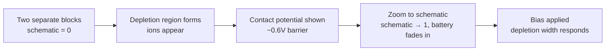
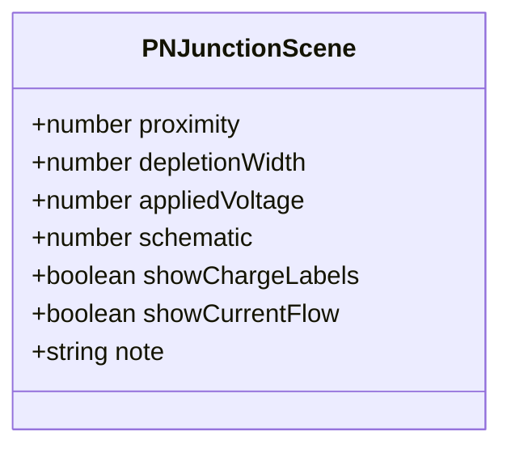

# `pn-junction` — from loose carriers to a biased diode

This module draws a pn junction across its whole story: two separate P-type
and N-type blocks, bringing them into contact, the depletion region forming
as carriers recombine into fixed ions, the contact potential that separation
of charge creates, and finally what reverse bias, partial forward bias, and
full forward bias each do to that depletion region. It's the same
architecture as `waveform/` (see that module's README for the full
reasoning) — a continuous, eased scene instead of discrete frames — because
this is a physical process that has to keep looking alive (carriers drifting)
between commands, not a static diagram.

## Why this is one component, not two

The source material actually shows two visual registers: a "microscopic"
view (loose holes and electrons, ions popping in at the junction) for
teaching WHAT a depletion region physically is, and a "circuit schematic"
view (flat red/blue blocks, a battery, wires) for teaching what bias DOES.
Building these as two separate components would lose the most useful moment
in the whole lesson: watching the detailed picture simplify into the
schematic symbol you'll actually use in a real circuit is itself worth
teaching, not just a jump cut between two screens.

So `PNJunctionScene.schematic` (0 → 1) is a single continuous dial the view
eases across: carriers and ions fade out, the block colors shift from
gray/gray to red/blue, and a battery with wires fades in — all the same
`approach()` easing every other numeric field in this scene uses. Nothing
about bias makes sense to show until a lesson has actually earned the
"zoom out" moment, which is exactly why every `applyBias()` result in
`pn-ops.ts` sets `schematic: 1`.

## The `PNJunctionScene` contract

`depletionWidth` isn't set directly by a spoken command — it's derived from
`appliedVoltage` by `depletionWidthFor()` in `pn-junction-frame.ts`, the
textbook-standard model: reverse bias widens it, forward bias narrows it
linearly, and it collapses to exactly 0 right at `BARRIER_VOLTAGE` (0.6V,
silicon's real contact potential). That function is the one place this
physics lives — `pn-ops.ts` calls it to build a scene, `PNJunctionView` never
recomputes it.

## The visual language

| Element | Color | Meaning |
|---|---|---|
| P block | dark gray → red (as `schematic` rises) | the hole-rich, boron-doped side |
| N block | light gray → blue (as `schematic` rises) | the electron-rich, phosphorus-doped side |
| Hole | orange ring | a missing electron in the P side — a free positive carrier |
| Electron | orange filled dot | a free electron in the N side |
| Ion | dark circle (−) / light circle (+) | fixed charge left behind once a hole and electron recombine |
| Depletion band | amber, translucent | the carrier-free zone — its width is the whole story |
| Current | sky blue, dashed, animated | flowing only once the depletion region has fully collapsed |

Two of these are deliberate, literal reuses of conventions this app already
established, not new choices invented for this module:

- The dark canvas background (`#0b0f17`) is the exact same value
  `waveform/`'s scope uses — every canvas-drawn component in this app lives
  on the same dark surface.
- Sky-blue dashed + animated dash-offset for current is `circuit/`'s
  "energized wire" convention, reapplied here because it's the same concept:
  current is flowing right now. A pn junction IS the physics behind a diode,
  so borrowing the circuit module's own visual language for "current" is
  more honest than inventing a second one.

Everything else — the orange carriers, the black/white ions, the amber
depletion band — comes directly from the reference material a real course
uses for this topic, kept as-is on purpose: matching what a student's
actual textbook or lecture slides show them matters more here than forcing
every color in this app to come from one shared palette.

The bias badge (`unbiased`/`reverse`/`partial-forward`/`forward`, via
`biasRegime()`) follows the same shape as `waveform/`'s modulation-index
badge, but the color mapping is NOT copied 1:1 — reverse bias isn't a
mistake the way over-modulation is, so it's `info` (neutral blue), not
`error`. Forward-and-conducting is `success` (green) because current
actually flowing is the genuinely good outcome this whole demo builds to.

## The recombination animation — why particles, not just the ion reveal

The ions themselves reveal via a threshold on `depletionWidth` (see the
scene contract above) — that alone tells you an ion exists, but not that
anything is *happening*. `pn-junction-view.tsx` also runs a small,
perpetual pool of `Migrant` particles (`makeMigrants`/`advanceMigrants`,
distinct from the idle-jitter `Carrier` pool) that continuously travel from
out in the bulk toward a slot at the junction and flash on arrival, right
where that slot's ion sits.

The "exchange" reading is a side effect of geometry, not anything explicitly
staged: P-side particles travel rightward, N-side particles travel leftward,
and both pools target the same six central slots — two independent streams
converging on the same points from opposite directions reads as trading
places, without the code ever pairing one specific hole with one specific
electron.

A migrant's destination slot is chosen from `activeSlotCount(depletionWidth)`
— the same "how many of the six slots are actually live right now" logic the
static ion reveal uses — so the motion stays tied to the real depletion
state instead of animating independently of it: wider depletion region, more
slots a migrant can be sent to.

## Files

| File | What's in it |
|---|---|
| `pn-junction-frame.ts` | `PNJunctionScene` type, `pnJunctionScene()`, `depletionWidthFor()`, `biasRegime()`, `BARRIER_VOLTAGE`. Zero React. |
| `pn-junction-view.tsx` | The renderer — eases toward the target scene, runs the carrier idle-motion clock, draws everything on `<canvas>`, layers the HTML legend/badge on top. |
| `index.ts` | The barrel — the only import path anything outside this folder should use. |

The domain layer lives in `features/pn-junction/`:

- `lib/pn-ops.ts` — `showSeparateBlocks()`, `bringTogether()`,
  `formDepletionRegion()`, `showChargeLabels()`, `applyBias(voltage)`,
  `resetJunction()`. Each is self-sufficient, same reasoning as `am-ops.ts`.
- `hooks/use-pn-junction-player.ts` — thin orchestration, identical shape to
  `use-waveform-player.ts`.
- `components/pn-junction-demo.tsx` — spoken commands, a free-exploration
  voltage slider, and a static reverse/unbiased/forward comparison — the
  same three-ways-to-use-it structure `amplitude-modulation-demo.tsx` uses.

## What's NOT here yet

- **No live voice agent.** These are buttons standing in for sentences, not
  a real OpenAI Realtime session — this component is built specifically so
  that wiring one up later means handing `pn-ops.ts`'s functions to it as
  tools, the same pattern every other module in `features/` follows.
- **No I-V curve.** Forward conduction is modeled as a hard collapse at the
  barrier voltage, not the real exponential diode equation — accurate enough
  for what this component teaches (why a depletion region matters, what
  bias does to it), not a SPICE-grade device model.
