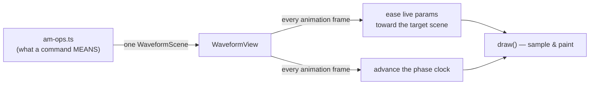
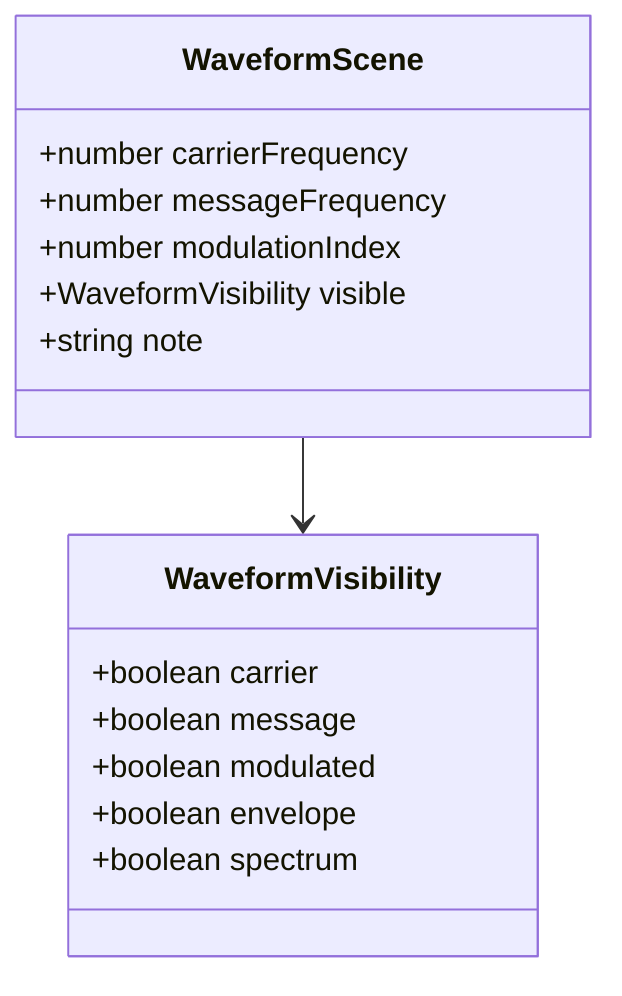

# `waveform` — a live scope for amplitude modulation

This module draws a continuously-moving signal: a carrier, a message, the
modulated wave the two combine into, its envelope, and (on request) the
frequency-domain view of the same thing. The first concept it's built for is
amplitude modulation (AM), a VTU analog-communications topic — but read the
"why AM-shaped, not generic" section below before assuming this is a
plot-anything library.

It follows the same overall shape as `array/` and `circuit/` — a pure data
type, a dumb-ish renderer, a feature-level "ops" layer that knows what a
spoken command means — but it bends that pattern in one real way, explained
in its own section below, because a live oscillating signal genuinely can't
be represented the way a sort step or a wire lighting up can.

## Why AM-shaped, not generic

A truly generic "plot any waveform" type needs either a formula per trace
(which means shipping arbitrary code across the wire to a renderer, or a tiny
DSL to interpret — real complexity) or a pre-sampled array per trace (which
throws away the "live, continuously oscillating" feel this whole component
exists for — see the next section). `WaveformScene` instead just says
"carrier frequency, message frequency, modulation index, which traces are
on" — small, obviously correct for AM, and a light enough surface that
widening it later (FM, sampling, a simple filter) is a real option once
there's a second concept actually asking for it. Building that abstraction
now, on a guess, is exactly the kind of premature generalization that makes
a component harder to read for the one thing it's actually used for today.

## Why this player is different from array/circuit's

`ArrayFrame` and `CircuitFrame` are snapshots: a sort's frame N vs frame N+1
are two genuinely different, fully-specified pictures, and stepping between
them on a timer is enough to look like something happened. An oscillating
signal doesn't have that option — even while nothing else is changing, the
picture has to keep moving, or it stops looking like a signal and starts
looking like a frozen squiggle. Pre-baking "the carrier one frame later" as
a discrete step would mean either an absurd number of frames for one second
of motion, or visibly choppy playback.

So `WaveformView` is the one renderer in this codebase that isn't fully
dumb: it owns two animation-shaped jobs that array/circuit's renderers never
needed —

1. **A phase clock** that always advances, so the carrier/message/modulated
   traces are visibly oscillating even when nothing else has changed.
2. **An eased glide** from whatever's currently on screen toward the latest
   `WaveformScene`, so changing the modulation index (say) reads as a
   smooth transition, not a jump cut.

Both are rendering concerns — "how should a change look," not "what does a
change mean" — the same category `roundedPath()` (wire-corner smoothing) is
in inside `CircuitView`. The actual domain logic — what modulating at
μ = 1.6 MEANS, what note to show, which traces should be on — still lives
entirely in `am-ops.ts`, one level up, same as always.

## Why canvas, not SVG, for the curve itself

Everything that's actually TEXT here — the legend, the modulation-index
badge, tooltips — is ordinary HTML layered over the scope, animated with
`motion/react` exactly like every other hover/crossfade in this app. Only
the waveform curves and their shading are drawn on a `<canvas>`. Three
reasons that split is deliberate, not a stylistic preference:

1. **One consistent animation model, not two.** `motion/react` is already
   the only animation library `array/` and `circuit/` use. Reaching for a
   charting library (D3, Observable Plot, Recharts) or a second animation
   library (GSAP) here would mean a contributor has to learn a second way
   things move in this codebase, for a feature that doesn't actually need
   anything those libraries do that raw canvas + `motion/react` can't.
2. **The curve itself is the wrong job for the DOM.** This resamples ~640
   points, five traces, every frame, at 60fps. An SVG `<path>` rebuilt from
   a fresh coordinate string every frame (whether hand-rolled or through a
   charting library) means the browser re-parses that string and reflows a
   DOM node 60 times a second; a canvas 2D context just paints pixels
   directly into a bitmap, with no parse step and no DOM node to reconcile.
   The badge and legend stay real DOM because THEIR update rate is "once
   per spoken command," where the DOM's overhead is irrelevant.
3. **No charting library assumes what this needs.** The scope always has
   two things moving at once — a phase clock that never stops, and a
   separate eased glide toward a new target whenever a command changes a
   parameter. Every charting library's transition system is built around
   "here's a new dataset, animate to it" as a single discrete event; it has
   no notion of "and also there's a continuous animation running underneath
   that, always." Hand-rolling the ~10-line exponential-approach easing in
   `waveform-view.tsx` was less code than making a charting library do
   something its transition model doesn't expect, and it's easy to read in
   one sitting.

## The `WaveformScene` contract

`carrierFrequency`/`messageFrequency` are "cycles visible across the
plotted window," not real Hz — this is a teaching picture, not an
instrument, and what actually matters pedagogically is the RATIO between
the two (a message far slower than its carrier), not any specific number.

## The visual language

| Trace | Color | Style | Meaning |
|---|---|---|---|
| Carrier | sky blue | solid, thin | the high-frequency wave that gets transmitted, carrying nothing by itself |
| Message | violet | dashed | the actual signal that needs to travel |
| Modulated | amber | solid, thick | the carrier with its amplitude following the message — what's actually sent |
| Envelope | emerald | dashed, shaded fill between upper/lower | the shape traced by the modulated wave's peaks — literally `1 + μ·message(t)` |
| Spectrum bars | sky (carrier) / violet (sidebands) | solid bars | the same signal, frequency domain — a line at fc, one sideband fm to each side |

Amber for the modulated wave is the same "this is the asserted/active thing"
convention `circuit/`'s README documents for lit LEDs and closed switches —
consistent meaning across every module in this app, not a new one invented
here.

The scope's background is fixed dark regardless of the app's light/dark
theme — the same deliberate choice every real oscilloscope, DAW, and audio
tool makes: a scope screen doesn't follow the room's lighting. This also
sidesteps a real technical problem: canvas colors are set once per draw
call as literal values, not CSS, so there's no cheap way to read the app's
current theme tokens 60 times a second the way an SVG's `currentColor`
trick lets `circuit/` do it. Fixed, deliberately-chosen colors are the
honest answer here, not a workaround.

The modulation-index badge classifies μ into four textbook regimes
(`modulationRegime()` in `waveform-frame.ts`) — under-modulated, ideal
(100%), over-modulated, or none yet — and only crossfades when the
classification actually changes, not on every small drag of the slider.
That's the one animation trigger in this whole component that's about a
CONCEPTUAL boundary rather than a raw number changing, which is exactly why
it's worth a distinct crossfade instead of just riding the same continuous
ease as everything else.

## Three ways to use one component

`amplitude-modulation-demo.tsx` (in `features/amplitude-modulation/`) shows
the same `WaveformView` used three different ways, because "how should a
lesson show this" doesn't have one right answer:

1. **Spoken commands** — a scripted sequence, same shape as the arrays and
   circuits demos: click a sentence, the scope glides to match it. This is
   the shape a live voice agent will eventually drive.
2. **Explore it yourself** — direct sliders and switches, no script. This
   is the "let a student break it" mode — drag μ past 1 and watch
   over-modulation happen under your own hand.
3. **At a glance** — three fixed scopes (under/ideal/over) side by side,
   `showLegend={false}` for compactness, for the moment a lesson needs a
   static comparison rather than a story.

None of these is a special case in the component itself — all three are
just `WaveformView` fed a different `WaveformScene`, which is the actual
point of keeping the renderer dumb.

## Files

| File | What's in it |
|---|---|
| `waveform-frame.ts` | `WaveformScene`/`WaveformVisibility` types, `waveformScene()` to build one, `modulationRegime()`, `WAVEFORM_WIDTH`/`WAVEFORM_HEIGHT`. Zero React. |
| `waveform-view.tsx` | The renderer. Owns the phase clock and the eased glide (see above), draws curves + shading on `<canvas>`, and layers the HTML legend/badge on top. |
| `index.ts` | The barrel — the only import path anything outside this folder should use. |

The domain layer lives one level up, in `features/amplitude-modulation/`:

- `lib/am-ops.ts` — `showCarrierWave()`, `showMessageWave()`,
  `modulateAt(index)`, `showSpectrumAt(index)`, `resetWaveform()`. Each
  returns a complete `WaveformScene` plus a plain-English summary and an
  optional sound cue — no function here needs the board's current state as
  an input, because every AM scene is fully self-describing.
- `hooks/use-waveform-player.ts` — thin orchestration: remember the current
  target scene, log a summary line, play a cue. `WaveformView` does the
  actual work of getting from the old picture to the new one.
- `components/amplitude-modulation-demo.tsx` — the three-ways-to-use-it
  page described above.

## What's NOT here yet

- **No live voice agent.** Same as `circuit/`'s README: these are buttons
  standing in for sentences, not a real OpenAI Realtime session. Wiring one
  up means giving it `am-ops.ts`'s functions as tools, same pattern as
  `arrays-agent`.
- **No second modulation concept.** FM, PM, or sampling would each want
  their own `*-ops.ts` and probably their own scene shape — see "why
  AM-shaped, not generic" above for why that's a "build it when it's real"
  decision, not a "should have generalized up front" gap.
