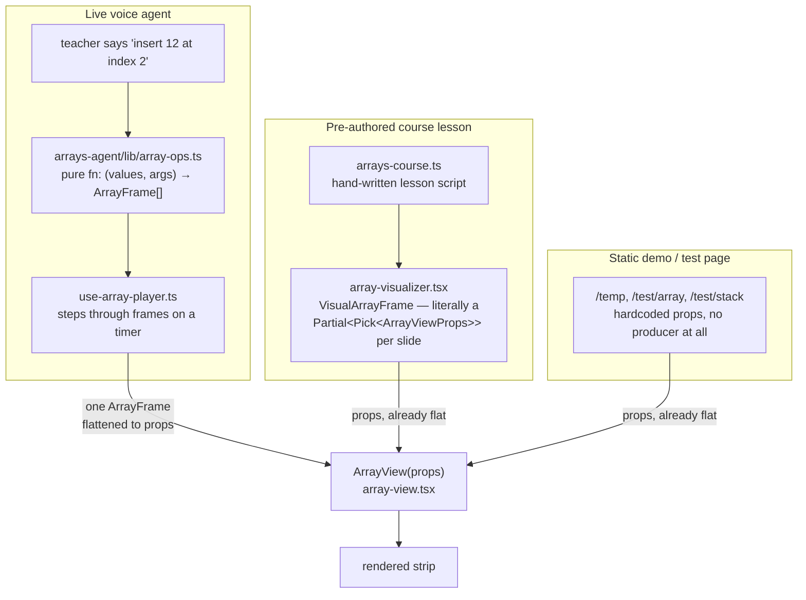
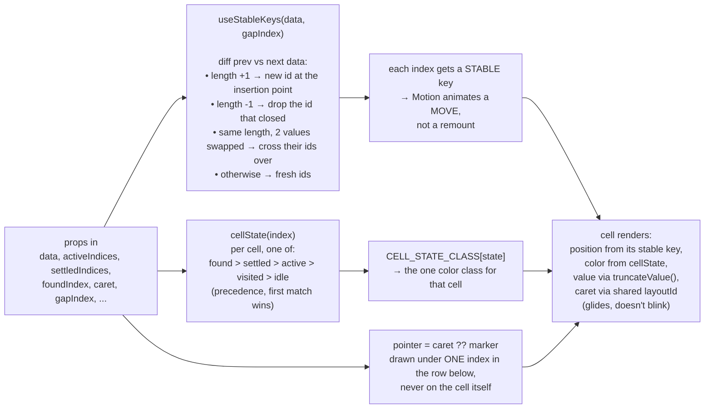

# Array module

Everything in this folder is `ArrayView` plus the one type it renders. No
insert, no delete, no sort, no idea who's calling it. That's the whole point
— read `array-frame.ts` and `array-view.tsx` end to end and you've read all
of it, there's nothing else hiding somewhere else in the repo for this part.

## Who feeds it, and what they feed it

Three real callers exist today. They don't share code with each other — they
only share the fact that they all end up calling `<ArrayView {...props} />`.



**The live agent is the only one that goes through `ArrayFrame`.** An
operation in `array-ops.ts` doesn't know about props or JSX — it returns a
*list* of `ArrayFrame` snapshots (one per animation beat), and something
upstream of this folder (`ArraysAgentBoard`) flattens whichever frame is
playing right now into the flat props below. The lesson and demo paths skip
`ArrayFrame` entirely and just hand `ArrayView` props directly — there's
nothing to animate through, so there's nothing to snapshot.

If you're adding a fourth producer: reuse `ArrayFrame` if you're building
something that plays out over TIME (a sequence of states). Skip it and pass
props directly if you're just describing ONE static picture.

## What `ArrayFrame` actually is

```mermaid
classDiagram
    class ArrayFrame {
        values: ArrayValue[]
        active: number[]
        visited: number[]
        settled: number[]
        found?: number
        marker?: { index, label }
        caret?: { index, label? }
        gap?: number
        held?: { value, label }
        note: string
    }
```

One snapshot, never a delta — `frame()` in `array-frame.ts` builds one. A
delta would force whatever plays these back to replay history just to know
the current state; a snapshot lets it jump anywhere. This is a **fixed
vocabulary**, not a grab-bag: `active` is the one cell being looked at,
`settled` means final/done, `found` means "this is the answer," `caret` means
"this position, not this value" (insert/delete point). Every operation in
`arrays-agent` reuses these same five ideas instead of inventing its own —
that's what lets one `ArrayView` render 20+ different operations without a
single `if (operationName === ...)` anywhere in this folder.

## What happens inside `ArrayView` for one render

This is the part worth actually reading in `array-view.tsx` — here's the
shape of it so the file isn't a wall of JSX the first time you open it.



The stable-key step is the one thing that isn't obvious from reading the
JSX top to bottom: without it, inserting a value at index 2 would make React
see "a shorter array became a longer one" and remount every cell from index 2
onward — which is what a value morphing into a different value looks like,
not what a slide looks like. `useStableKeys` is what turns "the array
changed" into "this specific element moved to this specific slot."

## Files

| File | What's in it |
|---|---|
| `array-frame.ts` | The `ArrayFrame`/`ArrayValue` types, `frame()` to build one, `MAX_ARRAY_LENGTH`, `truncateValue()`. Zero React. |
| `array-view.tsx` | The component. `useStableKeys`/`swappedIds`/`findDiffPoint` (identity across mutations), `cellState`/`CELL_STATE_CLASS` (five-state color vocabulary), `AccessExpressionLabel` (the floating `A[2]` label). |
| `index.ts` | The only import path anything outside this folder should use. |
